# Capstone Project: Shell Script for AWS IAM Management

## Introduction

In this project, I tackled the challenge of automating AWS Identity and Access Management (IAM) processes for CloudOps Solutions, a growing company embracing the power of cloud technology. As part of this endeavor, I designed and implemented a shell script to simplify the management of AWS IAM resources, including user creation, user group management, and permission assignments.

This project focuses on addressing a real-world need for scalability and efficiency as CloudOps Solutions expands its DevOps team. Automating IAM tasks not only saves time but also reduces human error, ensuring a secure and streamlined workflow for onboarding new hires. With this script, I aim to demonstrate my proficiency in shell scripting, AWS CLI, and my ability to solve practical problems in cloud environments.

## Purpose

The purpose of this project is to extend the functionality of a shell script to automate AWS IAM management tasks, including:

  + Defining an array of IAM user names.
  + Iterating through the array to create IAM users.
  + Creating an IAM group and assigning users to it.
  + Attaching an administrative policy to the group.

## Objectives

  + Automate the creation of AWS IAM users for new employees.
  + Assign users to a predefined IAM group.
  + Attach administrative privileges to the group for streamlined permissions management.
  + Ensure error handling and proper logging during execution for debugging.


## Implementation Steps

Prerequisite

  + Completion of foundational Linux knowledge with shell scripting mini projects.
  + AWS CLI installed and configured with appropriate permissions

## Tasks Breakdown

Task 1: Implement Version Control with Git

   + Initialize Git Repository

   + To begin, create the project directory named **Shell-Script-IAM**, navigate into it, and initialize it as a Git repository.

Note: For this project, I am using Vscode Git Bash on a Windows workstation to execute these shell commands as it provides a Unix-like command-line experience and VS Code boosts efficiency and ensures error-free development. 

### Commands:

```
mkdir Shell-Script-IAM
cd Shell-Script-IAM
git init
```
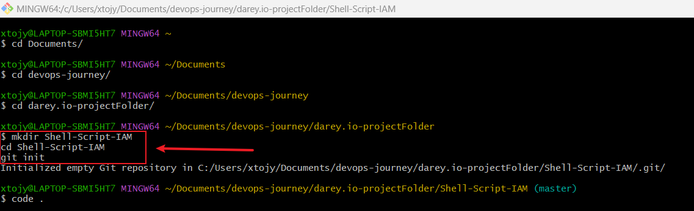

## Task 2: Script Enhancement

+ I Create a Bash script named aws_cloud_manager.sh. This script will handle IAM user and group management.

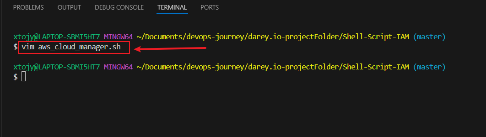

 + Ensure the script can execute AWS CLI commands for user and group management.

For Windows:

 + Install AWS CLI by following the AWS CLI Installation Guide.
 + Run the installer and follow the on-screen instructions.

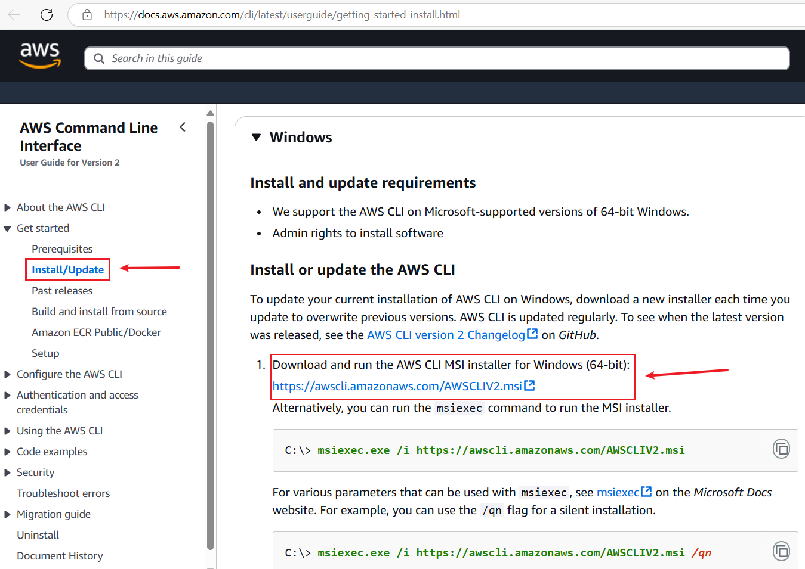

Verify the installation and configure AWS CLI  by opening Command Prompt and running: 

```
aws --version
aws configure
```

- vide the access key, secret key, default region, and output format.

 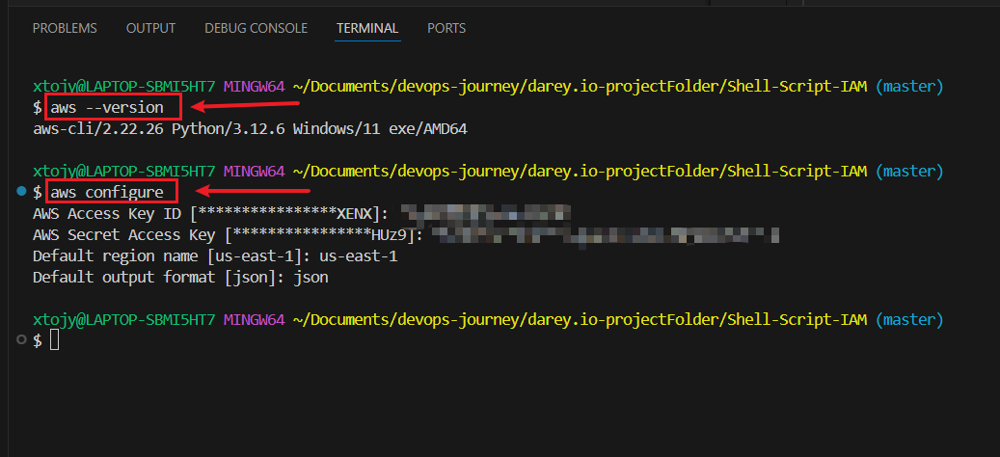


## Task 3: Define IAM User Names Array

I created an array to store the names of five IAM users ("Alice" "Bob" "Charlie" "Dave" "Eve"). This allows for easy iteration during user creation.

### command

#!/bin/bash

# Define IAM User Names Array
IAM_USERS=("Alice" "Bob" "Charlie" "Dave" "Eve")

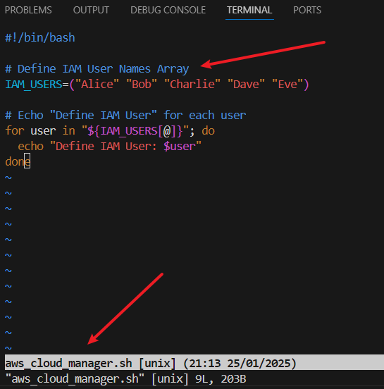

+ Make the script executable: 
    chmod +x aws_cloud_manager.sh

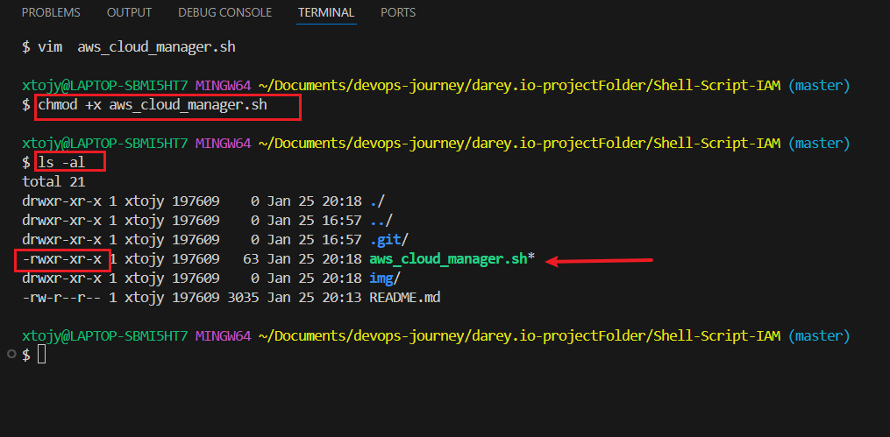

+ Execute the script: 
    ./aws_cloud_manager.sh

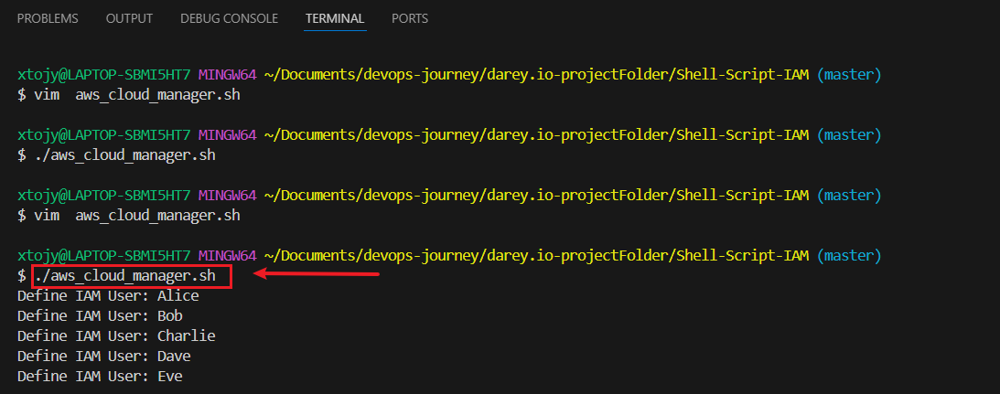

## Task 4. Create IAM Users

 + Iterate through the iam_users array and create IAM users using the following AWS CLI command:

 # Iterate through the IAM users array and create IAM users
for user in "${IAM_USERS[@]}"; do
  echo "Creating IAM user: $user"
  aws iam create-user --user-name "$user"

  # Check if the command succeeded
  if [ $? -eq 0 ]; then
    echo "Successfully created IAM user: $user"
  else
    echo "Failed to create IAM user: $user"
  fi
done

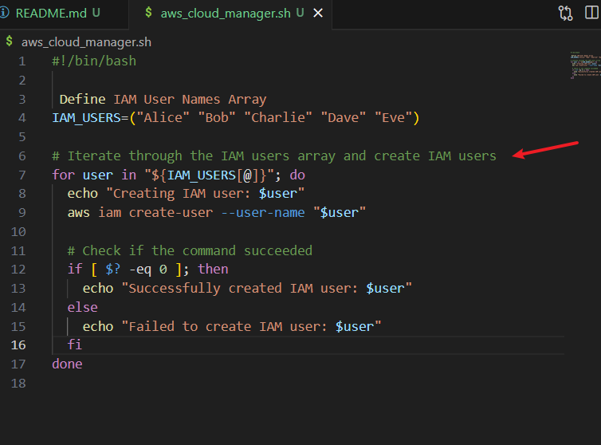

+ Execute updated script

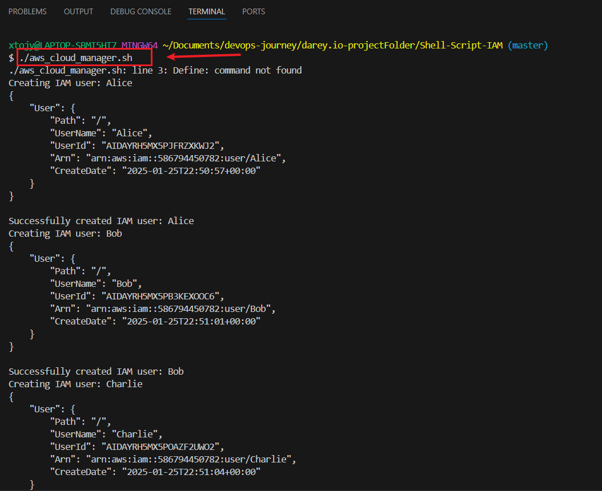

## Task 5: Create IAM Group
 + Define a function in the script to create an IAM group named admin:

 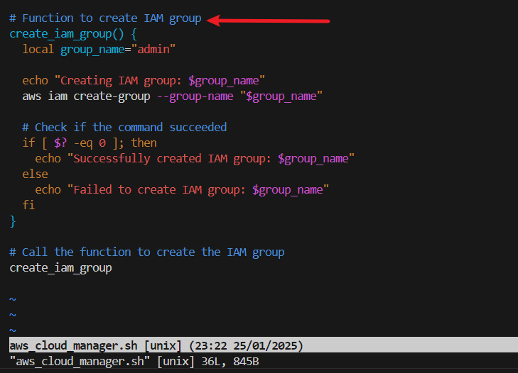

 + Execute updated script

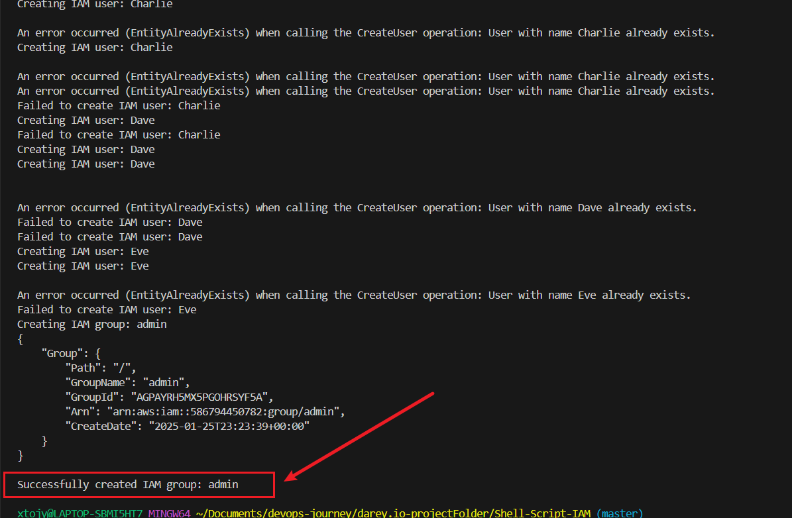

## Task 6. Attach Administrative Policy to Group
Attach the AdministratorAccess policy to the admin group:

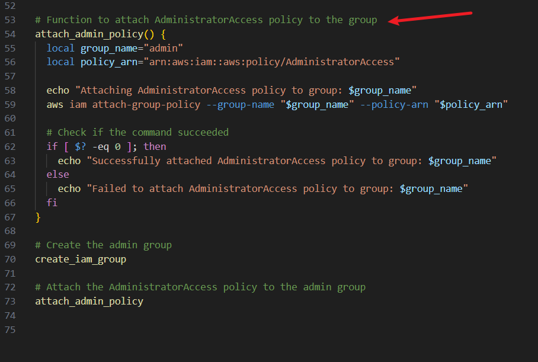

 + Execute updated script

 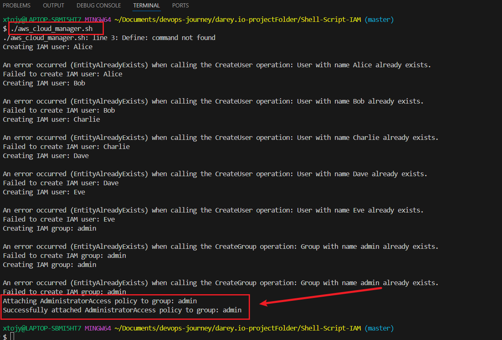

## Task 7. Assign Users to Group
Iterate through the iam_users array and add each user to the admin group:

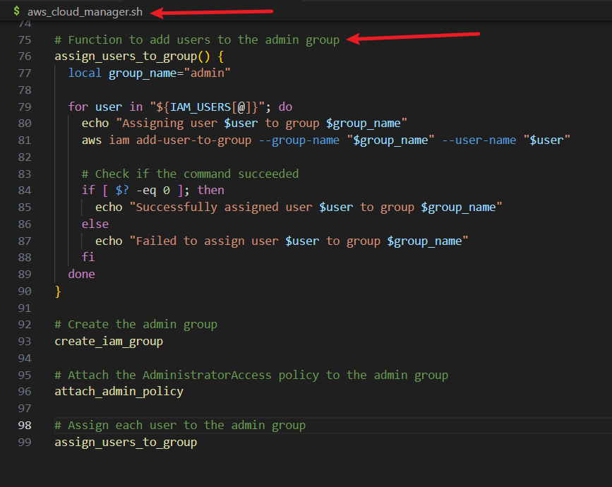

 + Execute updated script

 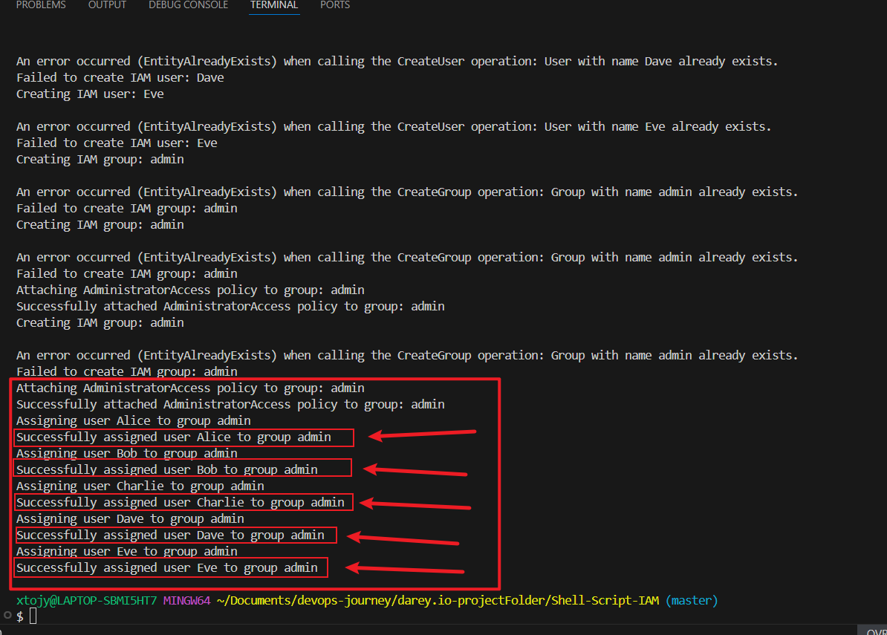

 ## Task 8. Project Deliverables

 ## Step 8.1: Comprehensive Documentation and My Thought Process

## Development Workflow

### Step 1: Define IAM User Names
I started by defining an array to store the names of the users to be created. Arrays allow us to iterate through the list efficiently.

**Code Implementation:**

```IAM_USERS=("Alice" "Bob" "Charlie" "Dave" "Eve")```

**Thought Process:** The names of IAM users are stored in an array for easy iteration during the creation process. This allows me to handle multiple users dynamically.

### Step 2: Create a Function to Create IAM Users
The core functionality of this script involves creating IAM users using the aws iam create-user command.

Code Implementation:

```
create_iam_users() {
    for user in "${IAM_USERS[@]}"; do
        echo "Creating IAM user: $user"
        aws iam create-user --user-name "$user"
        if [ $? -eq 0 ]; then
            echo "Successfully created IAM user: $user"
        else
            echo "Failed to create IAM user: $user"
        fi
    done
}

```

**Thought Process:**

  **Looping Through Users:** The for loop iterates through each user in the array, creating them one by one.

  **Command Execution:** The aws iam create-user command is used to create the user. This is a CLI command supported by AWS.

  **Error Handling:** The $? variable checks the exit status of the last command. If the exit code is 0, the command succeeded; otherwise, it failed. This helps ensure we log both successful and failed operations.


### Step 3: ADD IAM Group Creation

To manage permissions for multiple users, we decided to create a group and assign users to it.

  + Code Implementation:

```
create_iam_group() {
    GROUP_NAME="admin"
    echo "Creating IAM group: $GROUP_NAME"
    aws iam create-group --group-name "$GROUP_NAME"
    if [ $? -eq 0 ]; then
        echo "Successfully created IAM group: $GROUP_NAME"
    else
        echo "Failed to create IAM group: $GROUP_NAME"
    fi
}
```

**Thought Process:**

   + Groups in AWS allow collective permission management.

   + The aws iam create-group command is used to create the group.
   
   + As with user creation, error handling ensures proper logging.

### Step 4: Attach Administrative Policy to the Group

The AdministratorAccess policy grants full permissions to the group.

Code Implementation:

```
attach_policy_to_group() {
    GROUP_NAME="admin"
    echo "Attaching policy to IAM group: $GROUP_NAME"
    aws iam attach-group-policy --group-name "$GROUP_NAME" --policy-arn "arn:aws:iam::aws:policy/AdministratorAccess"
    if [ $? -eq 0 ]; then
        echo "Successfully attached policy to group: $GROUP_NAME"
    else
        echo "Failed to attach policy to group: $GROUP_NAME"
    fi
}
```

**Thought Process:**

  + The aws iam attach-group-policy command attaches an AWS-managed policy to the group.

  + The AdministratorAccess policy was chosen for simplicity.

### Step 5: Assign Users to the Group

Finally, I added functionality to assign each user to the created group.

 + Code Implementation:
 
 ```
 assign_users_to_group() {
    GROUP_NAME="admin"
    for user in "${IAM_USERS[@]}"; do
        echo "Adding user $user to group $GROUP_NAME"
        aws iam add-user-to-group --user-name "$user" --group-name "$GROUP_NAME"
        if [ $? -eq 0 ]; then
            echo "Successfully added user $user to group: $GROUP_NAME"
        else
            echo "Failed to add user $user to group: $GROUP_NAME"
        fi
    done
}
```

**Thought Process:**

  + The aws iam add-user-to-group command assigns users to the specified group.

  + Looping through the array ensures all users are assigned to the group.

## Step 6: Organize the Script
Finally, I called all functions in the proper sequence to ensure the script runs seamlessly.

### Final Script:

```
#!/bin/bash

# Define IAM User Names Array
IAM_USERS=("Alice" "Bob" "Charlie" "Dave" "Eve")

# Iterate through the IAM users array and create IAM users
for user in "${IAM_USERS[@]}"; do
  echo "Creating IAM user: $user"
  aws iam create-user --user-name "$user"

  # Check if the command succeeded
  if [ $? -eq 0 ]; then
    echo "Successfully created IAM user: $user"
  else
    echo "Failed to create IAM user: $user"
  fi
done

# Function to create IAM group
create_iam_group() {
  local group_name="admin"

  echo "Creating IAM group: $group_name"
  aws iam create-group --group-name "$group_name"

  # Check if the command succeeded
  if [ $? -eq 0 ]; then
    echo "Successfully created IAM group: $group_name"
  else
    echo "Failed to create IAM group: $group_name"
  fi
}

# Call the function to create the IAM group
create_iam_group

# Function to attach AdministratorAccess policy to the group
attach_admin_policy() {
  local group_name="admin"
  local policy_arn="arn:aws:iam::aws:policy/AdministratorAccess"

  echo "Attaching AdministratorAccess policy to group: $group_name"
  aws iam attach-group-policy --group-name "$group_name" --policy-arn "$policy_arn"

  # Check if the command succeeded
  if [ $? -eq 0 ]; then
    echo "Successfully attached AdministratorAccess policy to group: $group_name"
  else
    echo "Failed to attach AdministratorAccess policy to group: $group_name"
  fi
}

# Create the admin group
create_iam_group

# Attach the AdministratorAccess policy to the admin group
attach_admin_policy

# Function to add users to the admin group
assign_users_to_group() {
  local group_name="admin"

  for user in "${IAM_USERS[@]}"; do
    echo "Assigning user $user to group $group_name"
    aws iam add-user-to-group --group-name "$group_name" --user-name "$user"

    # Check if the command succeeded
    if [ $? -eq 0 ]; then
      echo "Successfully assigned user $user to group $group_name"
    else
      echo "Failed to assign user $user to group $group_name"
    fi
  done
}

# Create the admin group
create_iam_group

# Attach the AdministratorAccess policy to the admin group
attach_admin_policy

# Assign each user to the admin group
assign_users_to_group
```

## Conclusion

This script simplifies IAM user and group management by automating repetitive tasks. Proper error handling and logging ensure reliability, while AWS CLI commands provide robust functionality. The modular design allows for easy extension and maintenance.


Task 7. Uploading the Script to GitHub and Linking for Remote Execution

Steps to Upload My Script to GitHub
step 7.1: Stage and Commit the Template to Git

In this step, I will add the website files to the Git repository, configure my global Git settings, and make an initial commit with a descriptive message.

Add Files: Add all website files to the staging area.

Configure Git User Information: Set up global configuration with my actual git username and email address.

Commit Changes: Commit the changes with a clear and descriptive message.

```
git add .
git config --global user.name "Joy-it-code"
git config --global user.email "joynwat2014@gmail.com"
git commit -m "Initial commit: "Add Shell_Script_IAM script for automating user, group, and policy management"
```


Step 7.2: Push the code to your Github repository

After initializing your Git repository and adding your AWS-IAM-Manager.sh, the next step is to push your code to a remote repository on GitHub. This step is crucial for version control and collaboration.

Create a Remote Repository on GitHub: Log into your GitHub account and create a new repository named AWS-IAM-Manager. Leave the repository empty without initializing it with a README, .gitignore, or license.

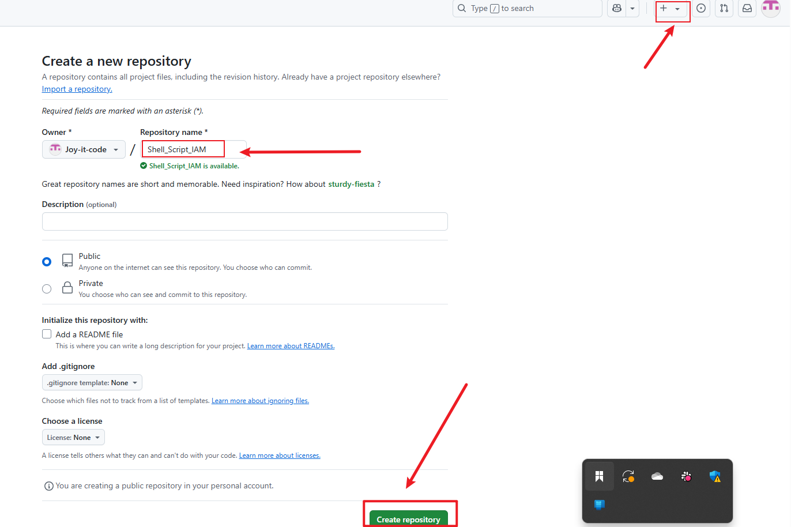
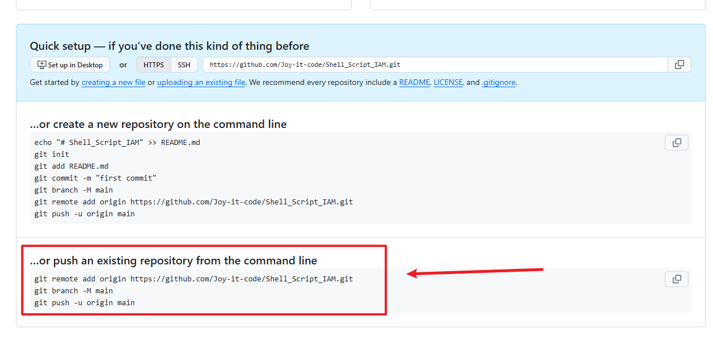

+ Link Your Local Repository to GitHub: In your terminal, within your project directory, add the remote repository URL to your local repository configuration.

+ Push Your Code: Upload Your Local Repository Content to GitHub Once you have linked your local repository to GitHub, use the following command to push your commits from your local main branch to the remote repository. This enables you to store your project in the cloud and share it with others.

**Commands:**

```
git remote add origin https://github.com/Joy-it-code/Shell_Script_IAM.git
git branch -M main
git push -u origin main
```


